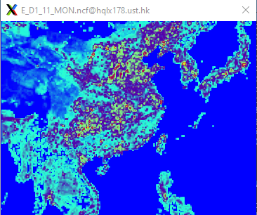

# Generate-meic2cmaq
*This tool generates model-ready emission files for CMAQ from MEIC inventory using Python.  
MEIC website: http://meicmodel.org.cn/#firstPage*

# Note
*For your convenience, the temporal profiles for monthly, weekly, and hourly allocations, as well as the chemical mechanism species are integrated into the Python script. Regarding spatial allocation, we did not provide spatial surrogate files due to different model domain settings for each case. Instead, spatial interpolation is adopted for mapping the spatial distribution of emissions.*

# Example
*MEIC+EDGAR*  

# Contact Info
*dliangad@connect.ust.hk*
